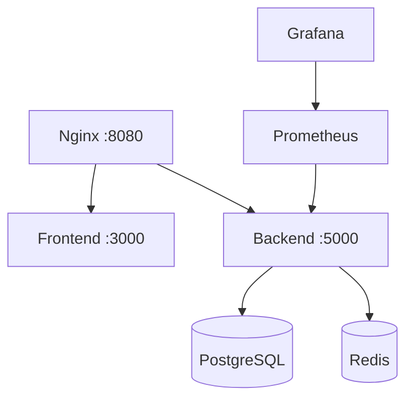

# DevOps Personal Project – Containerized Web Application

This project showcases a **full-stack containerized web application**, focused on real DevOps practices such as CI/CD pipelines, health checks, observability, and clear separation between build, deploy, and runtime concerns.

The main goal is to demonstrate **operability, automation, and platform thinking**, not just application development.

---

## Web Application

**Task Management Application (To-Do App)**  
A full-stack web application with authentication, task CRUD operations, and monitoring endpoints.

### Key Features

- **Backend**: Flask REST API with JWT authentication  
- **Frontend**: React + TypeScript with a modern UI  
- **Local infrastructure**: Docker Compose with multiple services  
- **CI/CD**: GitHub Actions (build, scan, integration tests)  
- **Observability**: Prometheus metrics and Grafana dashboards  
- **Basic security**: Nginx reverse proxy, security headers, rate limiting  
- **Containerized architecture** ready for scaling

---

## Project Goals

- Build a **container-ready web application**
- Apply real DevOps principles (CI/CD, health checks, observability)
- Clearly separate **build**, **deploy**, and **runtime**
- Design reproducible and auditable pipelines
- Serve as a **DevOps / Platform Engineering portfolio project**

---

## Architecture

### Technology Stack

#### Backend
- **Python 3.11**
- **Flask** (REST API)
- **SQLAlchemy** (ORM)
- **PostgreSQL** (database)
- **Redis** (cache / sessions)
- **JWT** (stateless authentication)
- **Gunicorn** (WSGI server)

#### Frontend
- **React 18**
- **TypeScript**
- **TailwindCSS**
- **Vite**
- **Axios**

#### DevOps / Infrastructure
- **Docker & Docker Compose**
- **Nginx** (reverse proxy)
- **Prometheus** (metrics collection)
- **Grafana** (visualization)
- **GitHub Actions** (CI/CD)

---

### Services Overview



---

## Quick Start

### Requirements

- Docker
- Docker Compose
- Git
- Recommended: **8 GB RAM**

---

### Local Deployment

```bash
git clone https://github.com/bruno-diaz-dev/proyecto-personal-devops-learn.git
cd proyecto-personal-devops-learn/app
./start.sh
```

### Access Points

- **Web Application**: http://localhost:8080  
- **Backend API**: http://localhost:8080/api  
- **Grafana**: http://localhost:3001 (admin / admin)  
- **Prometheus**: http://localhost:9090  

---

## Useful Commands

```bash
# Start services
./app/start.sh

# Stop services
./app/stop.sh

# Check container status
docker-compose -f app/docker-compose.yml ps

# View logs
docker-compose -f app/docker-compose.yml logs -f
```

---

## Health Checks & Observability

### Health Check Endpoint

The backend exposes a **shallow health check**, designed specifically for CI/CD pipelines and load balancers:

```bash
curl http://localhost:8080/api/health
```

Characteristics:
- No database dependency
- Fast response
- Ideal for integration tests and automation

---

### Metrics

- Endpoint: `/api/metrics`
- Exposed metrics:
  - CPU usage
  - Memory usage
  - Application uptime
- Scraped by Prometheus
- Visualized using Grafana dashboards

---

## Testing & Validation

### Integration Tests (CI)

The CI pipeline performs:
- Pulling the Docker image by immutable SHA
- Running the container
- Validating the `/api/health` endpoint

This ensures that the published image:
- Starts correctly
- Exposes the expected port
- Responds without external dependencies

---

### Manual API Testing

```bash
# Register user
curl -X POST http://localhost:8080/api/auth/register \
  -H "Content-Type: application/json" \
  -d '{"username":"test","email":"test@test.com","password":"password"}'

# Login
curl -X POST http://localhost:8080/api/auth/login \
  -H "Content-Type: application/json" \
  -d '{"username":"test","password":"password"}'
```

---

## Project Structure

```
proyecto-personal-devops-learn/
├── .github/workflows/        # CI/CD pipelines
├── app/
│   ├── backend/              # Flask API
│   ├── frontend/             # React application
│   ├── nginx/                # Reverse proxy
│   ├── monitoring/           # Prometheus config
│   ├── docker-compose.yml
│   ├── start.sh / stop.sh
├── infrastructure/           # IaC (Bicep)
├── scripts/                  # Automation scripts
└── README.md
```

---

## CI/CD (GitHub Actions)

The pipeline includes:
- Docker image build
- Security scanning (Trivy)
- Push to GitHub Container Registry
- Integration tests using immutable images (SHA)
- Clear separation between **build** and **deployment**

---

## Production Considerations

- Externalized environment variables
- Secrets kept outside the repository
- Health checks independent of infrastructure
- Immutable images
- Logs ready for centralization

---

## Project Purpose

This is **not a commercial product**, but a **realistic DevOps exercise** focused on:

- DevOps design
- Service operation
- Modern CI/CD
- Basic observability
- Cloud-native best practices

---

## License

Personal project for educational and DevOps learning purposes.


## Author 

### Bruno Mijail Diaz Barba

#### DevOps / Cloud Engineer | Azure